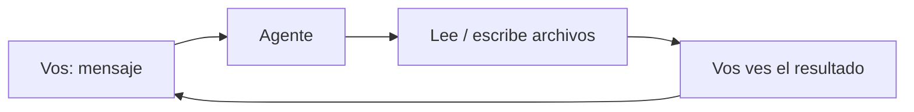

# 🧭 Nivel 01 — Fundamentos

> ⚠️ ¿Llegaste directo a este archivo, sin pasar por `INSTRUCCIONES-AGENTE.md` (raíz del repo) ni por el Nivel 00? Primero confirmá que estás usando un **agente de código** (Claude Code, Codex CLI, etc.) y no un chat común (ChatGPT/Claude/Gemini en el navegador) — esos no pueden hacer lo que sigue. Y si todavía no le contaste a tu agente quién sos y para qué querés esto, volvé a [Nivel 00 — Contexto](00-contexto.md), va primero.

## Qué es esto

Un agente de código no es solo un chat: además de responderte, puede **leer y escribir archivos reales en tu computadora**, dentro de la carpeta donde lo abriste. Todo lo que vas a construir en los próximos niveles — memoria, base de conocimiento, tu forma de trabajar — no es "configuración mágica": son archivos de texto simples que vos y tu agente leen y escriben juntos.



Ese ciclo — vos pedís, el agente toca archivos reales, vos ves el resultado — es la base de TODO lo que sigue.

## ⚠️ No perder tu carpeta — esto es más importante de lo que parece

Todo lo que vas a construir queda guardado DENTRO de la carpeta que elegiste para esto — no "en la nube", no "en tu cuenta", en esta carpeta puntual de tu computadora. Si la próxima vez abrís tu agente en una carpeta distinta (aunque sea sin darte cuenta), el agente no va a ver nada de lo que hicieron juntos — va a parecer que "se olvidó de todo", pero en realidad está mirando un lugar equivocado.

**Hacé esto ahora, antes de seguir:**

1. Fijate el nombre completo de esta carpeta y dónde está (pedile a tu agente que te diga la ruta completa si no la sabés).
2. Guardá esa información en algún lugar que vayas a encontrar de nuevo (una nota en el celular, un papel, lo que sea) — algo así como "mi carpeta del agente está en [ruta]".
3. La próxima vez que quieras seguir, abrí tu agente EN ESA MISMA carpeta — no en una nueva, no en el escritorio, no en "Documentos" en general.

Si en algún momento no estás seguro de si estás en la carpeta correcta: buscá en tu computadora (con el buscador de archivos de tu sistema) un archivo llamado `quien-soy.md` — cuando exista (después del Nivel 00), la carpeta donde aparezca es la correcta.

## Antes de seguir

Confirmá que tu agente puede efectivamente leer y escribir en esta carpeta. Es un chequeo de 30 segundos, pero si falla acá, nada de lo que sigue va a funcionar.

De paso, aprovechamos el mismo momento para juntar dos datos más que vamos a necesitar más adelante (no hace falta que entiendas para qué todavía) — así no hay que volver a preguntarlos, ni descubrir a mitad de camino que algo falta: en qué sistema operativo estás, y si tu agente puede ejecutar un comando de terminal además de tocar archivos (son dos capacidades distintas — algunos agentes solo hacen una de las dos).

## Checkpoint

El agente crea el archivo, te dice la ruta completa de la carpeta (para que la anotes), te confirma tu sistema operativo, corre un comando de solo lectura sin problemas (o te avisa con claridad si no puede), y cuando le pedís que te diga qué dice el archivo, te repite el contenido correcto (no inventado).

---

> [!TIP]
> 🧭 **Decile esto a tu agente:**
>
> ```
> Creá un archivo llamado hola.md en esta carpeta, con el texto
> "Primer contacto: [fecha de hoy]". Después leelo y decime qué
> dice. Decime también la ruta completa de esta carpeta, para
> poder anotarla.
>
> Además, confirmame dos cosas más: en qué sistema operativo estoy
> (Windows, Mac o Linux), y si podés ejecutar un comando de
> terminal de solo lectura (por ejemplo, revisar si tengo git
> instalado y qué versión, sin instalar ni cambiar nada). Si no
> podés ejecutar comandos, decímelo así de simple, no es un
> problema todavía. Agregá las dos respuestas a hola.md, abajo del
> texto que ya pusiste.
> ```
