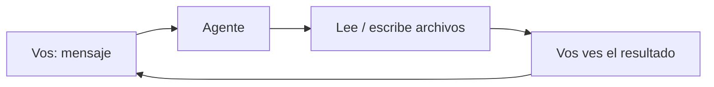

# Nivel 01 — Fundamentos

> ⚠️ ¿Llegaste directo a este archivo, sin pasar por `INSTRUCCIONES-AGENTE.md` (raíz del repo) ni por el Nivel 00? Primero confirmá que estás usando un **agente de código** (Claude Code, Codex CLI, etc.) y no un chat común (ChatGPT/Claude/Gemini en el navegador) — esos no pueden hacer lo que sigue. Y si todavía no le contaste a tu agente quién sos y para qué querés esto, volvé a [Nivel 00 — Contexto](00-contexto.md), va primero.

## Qué es esto

Un agente de código no es solo un chat: además de responderte, puede **leer y escribir archivos reales en tu computadora**, dentro de la carpeta donde lo abriste. Todo lo que vas a construir en los próximos niveles — memoria, base de conocimiento, tu forma de trabajar — no es "configuración mágica": son archivos de texto simples que vos y tu agente leen y escriben juntos.



Ese ciclo — vos pedís, el agente toca archivos reales, vos ves el resultado — es la base de TODO lo que sigue.

## Antes de seguir

Confirmá que tu agente puede efectivamente leer y escribir en esta carpeta. Es un chequeo de 30 segundos, pero si falla acá, nada de lo que sigue va a funcionar.

## Checkpoint

El agente crea el archivo, y cuando le pedís que te diga qué dice, te repite el contenido correcto (no inventado).

---

### Decile esto a tu agente:

```
Creá un archivo llamado hola.md en esta carpeta, con el texto
"Primer contacto: [fecha de hoy]". Después leelo y decime qué dice.
```
