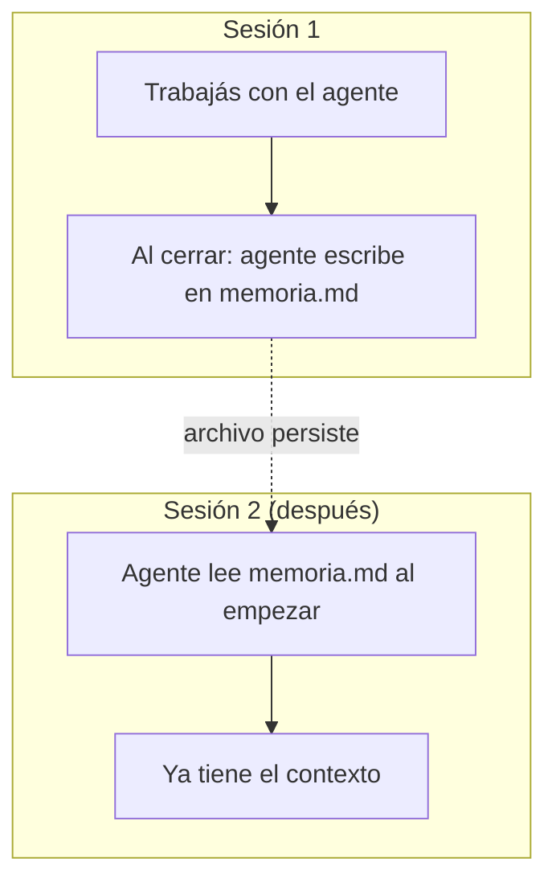

# Nivel 01 — Memoria persistente

## El problema

Por defecto, un agente **no se acuerda de nada** apenas cerrás la sesión. La próxima vez que lo abrís, es como si nunca hubieras hablado — le tenés que volver a explicar todo. Eso está bien para preguntas sueltas, pero es un problema en cuanto empezás a trabajar en algo que dura más de una sesión.

## La solución sin depender de nada externo

Un archivo (`memoria.md`) que el agente lee al EMPEZAR cada sesión, y actualiza al TERMINAR. No hace falta ninguna herramienta especial — es una convención que vos le das por escrito una sola vez, y el agente la sigue de ahí en adelante.



Más adelante (Nivel 05) vas a poder reemplazar este archivo simple por un sistema de memoria más completo (búsqueda, categorías, memoria compartida entre proyectos) — pero esa mejora no cambia el concepto de fondo, solo lo hace más cómodo a gran escala. Empezá con el archivo simple.

## Acción

Mirá `plantillas/memoria/memoria.md` — es el punto de partida. Copiala a la raíz de tu propio proyecto (no tiene por qué quedarse en esta carpeta de la guía) y decile a tu agente la regla de abajo.

## Checkpoint

Cerrá la sesión, abrí una nueva, y preguntale "¿qué hicimos la última vez?" — tiene que responder correctamente SIN que se lo repitas vos.

---

### Decile esto a tu agente:

```
A partir de ahora, quiero que tengas memoria entre sesiones así:
- Al EMPEZAR cada sesión, leé el archivo memoria.md de esta carpeta.
- Al TERMINAR cada sesión (o cuando yo diga "cerremos"), agregá al
  final de memoria.md un resumen corto de qué hicimos y qué quedó
  pendiente — sin borrar lo que ya había.
Confirmame que entendiste la regla antes de seguir.
```
