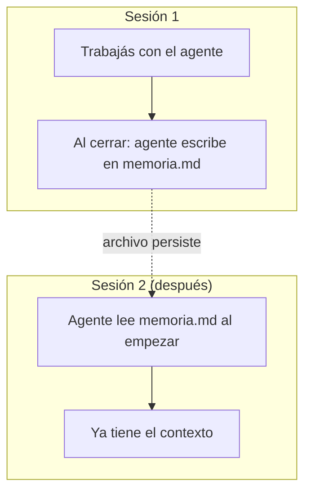

# 🧭 Nivel 02 — Memoria persistente

## El problema

Por defecto, un agente **no se acuerda de nada** apenas cerrás la sesión (una "sesión" es, básicamente, una conversación: desde que abrís el chat con tu agente hasta que lo cerrás). La próxima vez que lo abrís, es como si nunca hubieras hablado con él — le tenés que volver a explicar todo de cero. Para una pregunta suelta eso no molesta, pero es un problema en cuanto empezás a trabajar en algo que dura más de una charla.

## La solución, sin instalar nada

Un archivo llamado `memoria.md` que el agente lee al EMPEZAR cada sesión, y actualiza al TERMINAR. No hace falta ninguna herramienta especial ni instalar nada: es una regla simple que le das a tu agente una sola vez, por escrito, y de ahí en adelante la sigue solo, sin que se la tengas que repetir.



Más adelante vas a poder cambiar este archivo simple por un sistema de memoria más completo, que busca y organiza por vos en vez de que lo hagas a mano. Pero eso es solo una mejora de comodidad — la idea de fondo no cambia: el agente lee al empezar, escribe al cerrar. Por ahora, empezá con el archivo simple, que alcanza y sobra.

## Acción

Mirá `plantillas/memoria/memoria.md` — es el punto de partida, una plantilla vacía lista para usar. Copiala a la carpeta principal de tu propio proyecto (no tiene por qué quedarse acá, en la carpeta de esta guía) y decile a tu agente la regla de abajo.

## Checkpoint

Cerrá la sesión, abrí una nueva, y preguntale "¿qué hicimos la última vez?" — tiene que responder correctamente SIN que se lo repitas vos.

---

> [!TIP]
> 🧭 **Decile esto a tu agente:**
>
> ```
> A partir de ahora, quiero que tengas memoria entre sesiones así:
> - Al EMPEZAR cada sesión, leé el archivo memoria.md de esta carpeta.
> - Al TERMINAR cada sesión (o cuando yo diga "cerremos"), agregá al
>   final de memoria.md un resumen corto de qué hicimos y qué quedó
>   pendiente — sin borrar lo que ya había.
> Confirmame que entendiste la regla antes de seguir.
> ```
