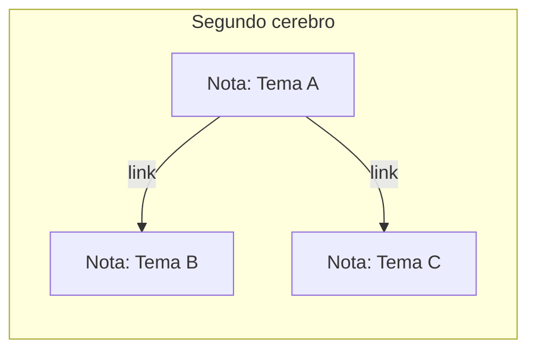

# Nivel 02 — Segundo cerebro

## Memoria vs. base de conocimiento — no es lo mismo

La memoria del Nivel 01 es chica y cronológica: "qué pasó la última vez". Un **segundo cerebro** es distinto: es una base de conocimiento organizada POR TEMA, que crece con el tiempo y no se borra ni se resume — cada nota vive, y se conecta con otras notas relacionadas.



## La convención mínima

No hace falta una app especial (aunque herramientas como Obsidian lo hacen más cómodo de navegar visualmente — opcional, no obligatorio). Alcanza con:

- Una carpeta.
- Un archivo markdown por tema.
- Un encabezado simple arriba de cada nota (de qué trata, cuándo la tocaste por última vez).
- Links entre notas relacionadas (`[[nombre-de-la-otra-nota]]` si usás Obsidian, o simplemente nombrarla en el texto si no).

Mirá `plantillas/segundo-cerebro/_ejemplo-nota.md` para ver la forma mínima.

## Acción

Elegí un tema real que te importe (no tiene que ser grande). Pedile al agente que cree la primera nota siguiendo la convención, y una segunda nota sobre algo relacionado, linkeada a la primera.

## Checkpoint

Días después (o ahora mismo, simulando), preguntale al agente algo sobre ese tema — tiene que poder buscar en las notas y responder con lo que ahí escribiste, no inventar.

---

### Decile esto a tu agente:

```
Quiero armar mi segundo cerebro. Elegí el tema "[tu tema real acá]".
Creá una carpeta segundo-cerebro/ si no existe, y adentro una nota
sobre ese tema siguiendo la convención de plantillas/segundo-cerebro/.
Después creá una segunda nota sobre [un tema relacionado], linkeada
a la primera. Cuando termines, preguntame qué sé sobre el tema
buscando en esas notas, para confirmar que funciona.
```
