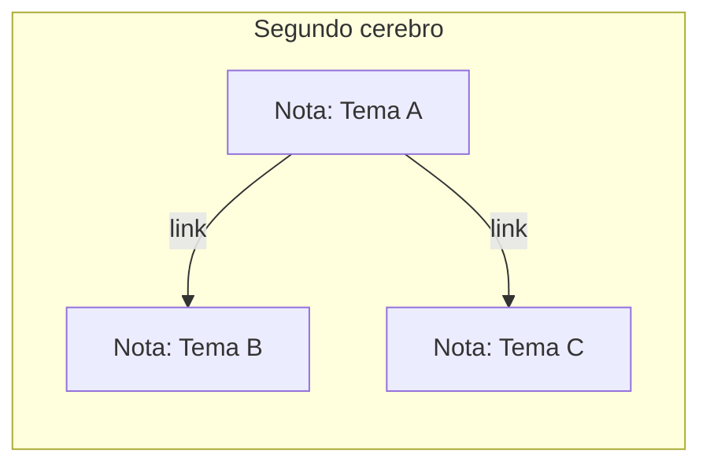

# Nivel 03 — Segundo cerebro

## Memoria vs. base de conocimiento — no es lo mismo

La memoria del Nivel 02 es chica y cronológica: "qué pasó la última vez". Un **segundo cerebro** es distinto: es una base de conocimiento organizada POR TEMA, que crece con el tiempo y no se borra ni se resume — cada nota vive, y se conecta con otras notas relacionadas.



## La convención mínima

No hace falta una app especial para que esto funcione. Alcanza con:

- Una carpeta.
- Un archivo markdown por tema.
- Un encabezado simple arriba de cada nota (de qué trata, cuándo la tocaste por última vez).
- Links entre notas relacionadas.

Mirá `plantillas/segundo-cerebro/_ejemplo-nota.md` para ver la forma mínima.

## Instalando Obsidian — recomendado, te lo va a hacer mucho más cómodo de ver

Los archivos de texto de arriba andan igual sin esto — pero una app te deja VER las notas con formato lindo y las conexiones entre ellas dibujadas, en vez de abrir cada `.md` a mano.

Tu agente puede dejar TODO listo de antemano (instalar la app, y descargar+activar los 2 plugins que usamos) — así te quedan solo **2 clicks tuyos**, no más: abrir la carpeta, y aceptar un aviso de seguridad que Obsidian muestra siempre la primera vez (ese aviso no se puede saltear con ningún script — es a propósito, para que un vault ajeno no pueda correr código sin que vos lo confirmes).

**1. Instalación + plugins ya listos — esto lo hace tu agente entero, vos no tocás nada todavía:**

```
Instalá Obsidian en esta computadora (winget en Windows, brew
--cask en Mac, o el método que corresponda a mi Linux si es
otro — preguntame antes si no tenés Homebrew). Después, en esta
misma carpeta, dejá pre-instalados y habilitados los plugins
Dataview (blacksmithgu/obsidian-dataview) y Git (Vinzent03/obsidian-git):
descargá los archivos de su último release de GitHub a
.obsidian/plugins/dataview/ y .obsidian/plugins/obsidian-git/,
y agregá sus IDs a .obsidian/community-plugins.json. Avisame
cuando todo esto esté listo.
```

**2. Los 2 clicks que te quedan a vos — con guía oficial de Obsidian:**

Solo esto es manual (nadie puede scriptearlo por vos, ni siquiera Obsidian mismo lo permite):

- **Abrir esta carpeta como vault** — guía oficial: [obsidian.md/help/vault](https://obsidian.md/help/vault) (sección "Open existing folder"). Es 3 pasos: click en "Open" al lado de "Open folder as vault", elegís esta carpeta, click en "Open".
- **Confirmar que confiás en los plugins** — la primera vez que abras esta carpeta, Obsidian te va a preguntar si confiás en el autor del vault (porque ya trae plugins con código dentro) — guía oficial: [obsidian.md/help/community-plugins](https://obsidian.md/help/community-plugins). Como sos vos quien lo armó (con tu agente), confiá y aceptá.

Esos links son la documentación OFICIAL de Obsidian — son de texto, sin capturas de pantalla (así es como Obsidian la mantiene). Si en algún paso no entendés qué estás viendo en tu pantalla, describíselo a tu agente y que te ayude a identificarlo — no hace falta que la imagen esté en un documento para que tu agente te pueda orientar.

### Decile esto a tu agente (después de tus 2 clicks):

```
Ya abrí la carpeta como vault y confirmé que confío en los
plugins. Confirmá que ves la carpeta .obsidian/plugins/ con
dataview y obsidian-git adentro, y contame en una línea para
qué sirve cada uno con tus propias palabras.
```

**¿Preferís no instalar nada por ahora?** Está perfecto — seguí con los archivos de texto plano de arriba, funcionan igual. Podés volver a esto cuando quieras.

## Conectar tu agente al vault por MCP — para que consulte y escriba por etiqueta, no a ciegas

Esto solo aplica si instalaste Obsidian arriba. Hasta acá, tu agente escribe notas en el vault porque se lo pedís en el chat — pero no puede "preguntarle al vault" cosas como *"traeme todas las notas etiquetadas como pendiente"* ni insertar una nota nueva respetando esas etiquetas, salvo que tenga una conexión dedicada para eso. Esa conexión se llama **MCP** (Model Context Protocol) — un puente estándar entre tu agente y una herramienta externa, en este caso tu propio vault.

**1. Plugin adicional — mismo mecanismo que Dataview/Git de arriba, tu agente lo deja listo:**

```
Además de Dataview y Git, dejá pre-instalado y habilitado el plugin
Local REST API (coddingtonbear/obsidian-local-rest-api) en esta
carpeta, con el mismo método que los otros dos. Antes de conectar
nada, verificá que la versión instalada sea 4.1.3 o más nueva —
versiones anteriores tienen una falla de seguridad ya corregida
(path traversal, GHSA-62gx-5q78-wrvx). Si el release que bajaste
es más viejo, avisame antes de seguir.

Este plugin trae el servidor HTTP simple (sin certificado) APAGADO
por defecto — solo enciende el HTTPS con certificado propio, que la
mayoría de clientes MCP van a rechazar. Para que esto funcione con
el mínimo de clicks, escribí ya el archivo
.obsidian/plugins/obsidian-local-rest-api/data.json con el contenido
{"enableInsecureServer": true} ANTES de que yo abra Obsidian por
primera vez — así el plugin arranca con el servidor simple ya
prendido, sin que yo tenga que tocar ningún toggle en sus ajustes.
```

**2. Después de tus 2 clicks de siempre (abrir como vault + confirmar que confiás), decile esto a tu agente:**

```
Ya abrí el vault con el plugin Local REST API activado. Este plugin
genera automáticamente una clave de acceso la primera vez que corre
— buscala en .obsidian/plugins/obsidian-local-rest-api/data.json y
usala para conectarte a mí mismo por MCP. Usá el puerto HTTP 27123
(http://127.0.0.1:27123/mcp/), NO el HTTPS 27124 — ese segundo
puerto usa un certificado que el plugin se firma a sí mismo, y la
mayoría de los clientes MCP lo rechazan por no ser de una autoridad
confiable. Antes de intentar conectar, confirmá en ese mismo
data.json que "enableInsecureServer" quedó en true — si sigue en
false (podés haberlo pisado si abriste Obsidian antes de que yo
escribiera el archivo), cambialo ahí o desde Obsidian → Settings →
Local REST API → activá el toggle del servidor sin cifrar, y recién
ahí el puerto 27123 va a responder. Una vez conectado, probá una
consulta simple para confirmar que funciona.
```

Tu agente sabe cómo agregar un servidor MCP por HTTP en su propia herramienta (el comando exacto cambia según si es Claude Code, Codex CLI, u otro) — no hace falta que vos sepas el comando, pedíselo y que lo resuelva.

**¿Ya intentaste esto y no conectó?** Hay dos causas posibles, no una sola:

1. **Probaste el puerto 27124 (HTTPS)** — falla por el certificado autofirmado, como se explica arriba. Solución: usar 27123.
2. **Probaste el 27123 y tampoco respondía nada** — este plugin trae el servidor sin cifrar APAGADO por defecto. Si por algún motivo el toggle no quedó activado (por ejemplo, si Obsidian ya había corrido una vez antes de que tu agente escribiera `data.json`), el puerto directamente no va a escuchar, sin importar a cuál apuntes. Andá a Obsidian → Settings (⚙️) → Community plugins → Local REST API, y activá manualmente la opción de servidor sin cifrar (HTTP) — recién ahí 27123 responde.

**3. La parte que realmente importa: etiquetas consistentes, no un caos de tags distintos**

Que tu agente pueda *consultar* el vault por MCP no sirve de mucho si cada nota usa una etiqueta distinta para lo mismo. La convención que hace que esto funcione de verdad:

- Cada nota lleva unas pocas etiquetas fijas en su encabezado (de qué tema es, en qué estado está — por ejemplo "en progreso" o "cerrado").
- Tu agente NO inventa una etiqueta nueva cada vez que se le ocurre una — reusa las que ya existen, salvo que decidan juntos crear una categoría nueva de verdad.
- Antes de escribir una nota nueva, tu agente consulta qué etiquetas ya existen (por MCP, o leyendo unas pocas notas de ejemplo) en vez de adivinar.

Esa disciplina — pocas etiquetas, reusadas siempre igual, consultables por tu agente — es lo que convierte un montón de archivos sueltos en una base de conocimiento que de verdad se puede interrogar.

### Decile esto a tu agente (para probar que la conexión + etiquetas funcionan juntas):

```
Buscá en el vault, por MCP, todas las notas que tengan la etiqueta
"[una etiqueta real de tu segundo cerebro]". Contame cuáles encontraste.
Después creá una nota nueva de prueba con esa misma etiqueta, insertada
por MCP (no escribiendo el archivo directo) — y confirmame que la
etiqueta que usaste ya existía antes, no la inventaste ahora.
```

**¿No te interesa esto todavía?** No hace falta — tu agente sigue pudiendo leer y escribir notas como hasta ahora, solo que pidiéndoselo directo en el chat en vez de por consulta estructurada. Podés volver a esto más adelante.

## Acción

Elegí un tema real que te importe (no tiene que ser grande). Pedile al agente que cree la primera nota siguiendo la convención, y una segunda nota sobre algo relacionado, linkeada a la primera.

## Checkpoint

Días después (o ahora mismo, simulando), preguntale al agente algo sobre ese tema — tiene que poder buscar en las notas y responder con lo que ahí escribiste, no inventar.

---

### Decile esto a tu agente:

```
Quiero armar mi segundo cerebro. Elegí el tema "[tu tema real acá]".
Creá una carpeta segundo-cerebro/ si no existe, y adentro una nota
sobre ese tema siguiendo la convención de plantillas/segundo-cerebro/.
Después creá una segunda nota sobre [un tema relacionado], linkeada
a la primera. Cuando termines, preguntame qué sé sobre el tema
buscando en esas notas, para confirmar que funciona.
```
