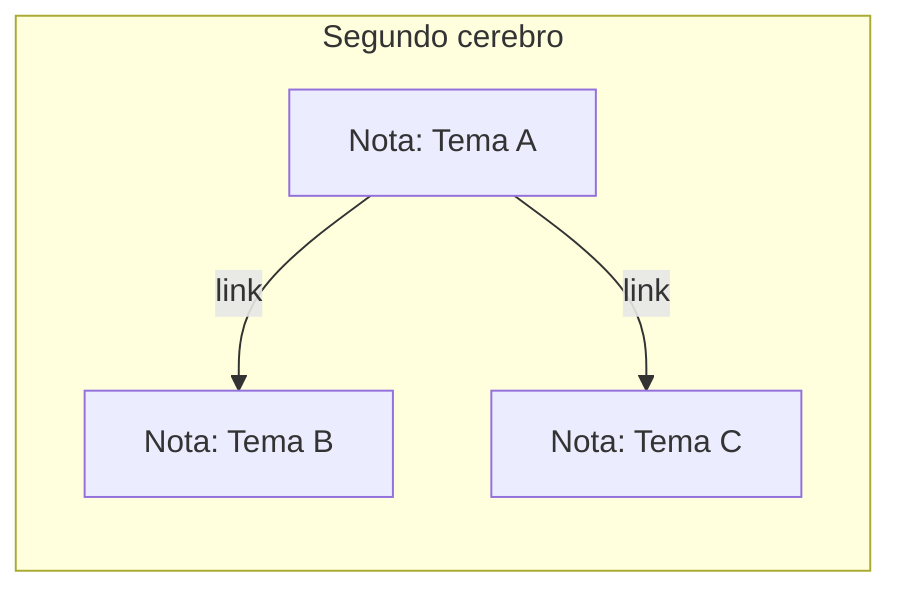

# Nivel 03 — Segundo cerebro

## Memoria vs. base de conocimiento — no es lo mismo

La memoria del Nivel 02 es chica y cronológica: "qué pasó la última vez". Un **segundo cerebro** es distinto: es una base de conocimiento organizada POR TEMA, que crece con el tiempo y no se borra ni se resume — cada nota vive, y se conecta con otras notas relacionadas.



## La convención mínima

No hace falta una app especial para que esto funcione. Alcanza con:

- Una carpeta.
- Un archivo markdown por tema.
- Un encabezado simple arriba de cada nota (de qué trata, cuándo la tocaste por última vez).
- Links entre notas relacionadas.

Mirá `plantillas/segundo-cerebro/_ejemplo-nota.md` para ver la forma mínima.

## Instalando Obsidian — recomendado, te lo va a hacer mucho más cómodo de ver

Los archivos de texto de arriba andan igual sin esto — pero una app te deja VER las notas con formato lindo y las conexiones entre ellas dibujadas, en vez de abrir cada `.md` a mano. Tu agente puede instalar la app, pero hay 3 clicks que tenés que dar vos — te digo exactamente cuáles.

**1. Instalación — esto lo hace tu agente:**

```
Instalá Obsidian en esta computadora. Si es Windows, usá
"winget install --id=Obsidian.Obsidian -e" en una terminal.
Si es Mac, usá "brew install --cask obsidian" (si no tengo
Homebrew, decime antes de instalar nada). Si es Linux, decime
qué distro uso y buscá el método correcto. Confirmame cuando
haya terminado.
```

**2. Abrir esta carpeta como "vault" — esto lo hacés vos, con el mouse, una sola vez:**

Abrí Obsidian (te va a aparecer un ícono nuevo en tu computadora). Va a aparecer una ventana con un botón que dice **"Open folder as vault"** — apretalo, y elegí esta misma carpeta. Listo, ya está conectada.

**3. Prender los plugins de comunidad — también con el mouse, una sola vez:**

Adentro de Obsidian: abajo a la izquierda hay un ícono de tuerca (⚙️, "Settings"). Hacé click ahí, después en "Community plugins" en la lista de la izquierda, y después en el botón que dice **"Turn on community plugins"**.

**4. Instalar 2 plugins concretos:**

Con eso ya prendido: en la misma pantalla de "Community plugins" apretá **"Browse"**, buscá por nombre, y para cada uno: **"Install"** y después **"Enable"**.

- **Dataview** — te deja hacer preguntas simples sobre tus notas.
- **Git** (`obsidian-git`) — te guarda un historial real de tus notas, para poder volver atrás si algo se rompe.

### Decile esto a tu agente (después de los 4 pasos de arriba):

```
Ya instalé Obsidian, abrí esta carpeta como vault, prendí
community plugins, e instalé Dataview y Git. Confirmá que ves
la carpeta .obsidian/ acá adentro, y contame en una línea para
qué sirve cada uno de esos dos plugins con tus propias palabras.
```

**¿Preferís no instalar nada por ahora?** Está perfecto — seguí con los archivos de texto plano de arriba, funcionan igual. Podés volver a esto cuando quieras.

## Acción

Elegí un tema real que te importe (no tiene que ser grande). Pedile al agente que cree la primera nota siguiendo la convención, y una segunda nota sobre algo relacionado, linkeada a la primera.

## Checkpoint

Días después (o ahora mismo, simulando), preguntale al agente algo sobre ese tema — tiene que poder buscar en las notas y responder con lo que ahí escribiste, no inventar.

---

### Decile esto a tu agente:

```
Quiero armar mi segundo cerebro. Elegí el tema "[tu tema real acá]".
Creá una carpeta segundo-cerebro/ si no existe, y adentro una nota
sobre ese tema siguiendo la convención de plantillas/segundo-cerebro/.
Después creá una segunda nota sobre [un tema relacionado], linkeada
a la primera. Cuando termines, preguntame qué sé sobre el tema
buscando en esas notas, para confirmar que funciona.
```
