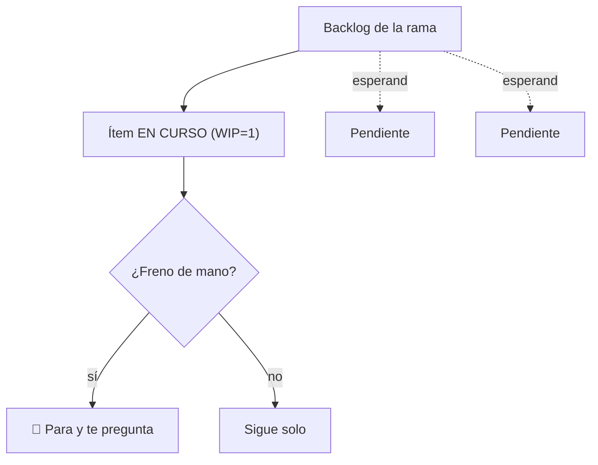

# Nivel 03 — Vocabulario y patrones de trabajo

Cuatro palabras que van a ordenar cómo trabajás con tu agente de acá en adelante. No son jerga por la jerga — cada una resuelve un problema real que aparece apenas el trabajo dura más de una sesión.

## Rama (con su backlog)

Una **rama** es una línea de trabajo con su propia lista de pendientes (backlog). No todo tiene que vivir junto — si estás en dos cosas distintas (por ejemplo, "aprender Python" y "organizar mis finanzas"), son dos ramas separadas, cada una con su propio backlog.

## WIP = 1 (Work In Progress = uno)

Solo **una** cosa activa a la vez, por rama. Antes de arrancar algo nuevo, terminá lo anterior o parkealo explícitamente. Esto evita el problema más común: siete cosas a medias y ninguna terminada.

## Freno de mano

Un punto donde el agente **tiene que parar y preguntarte** antes de seguir — porque la decisión es irreversible, o porque solo vos la podés tomar (gastar plata, borrar algo, mandar un mensaje a otra persona). Vos decidís dónde van los frenos de mano; el agente los respeta.

## Día de análisis

Una pasada periódica (semanal, por ejemplo) donde en vez de generar contenido nuevo, el agente **relee lo acumulado** y busca: contradicciones, cosas que ya no aplican, conexiones que no habías visto. Sin esto, un segundo cerebro que solo crece se vuelve un cajón desordenado.



## Acción

Definí una rama real (algo en lo que estés trabajando de verdad), con 2-3 ítems en su backlog, marcá cuál está en curso, y definí un freno de mano concreto para esa rama.

## Checkpoint

El agente respeta el freno de mano cuando llega a ese punto (para y pregunta, no sigue solo), y si intentás arrancar un segundo ítem mientras el primero sigue activo, te lo señala en vez de arrancarlo sin más.

---

### Decile esto a tu agente:

```
Vamos a organizar mi trabajo así: mi rama activa es "[nombre de tu
rama]", con este backlog: [ítem 1], [ítem 2], [ítem 3]. El ítem en
curso ahora es [ítem 1] — WIP=1, no arranques otro ítem mientras
este siga activo sin preguntarme primero.

Freno de mano: antes de [la acción irreversible/decisión que solo
vos tomás], parás y me preguntás explícitamente. No lo hagas solo.
```
