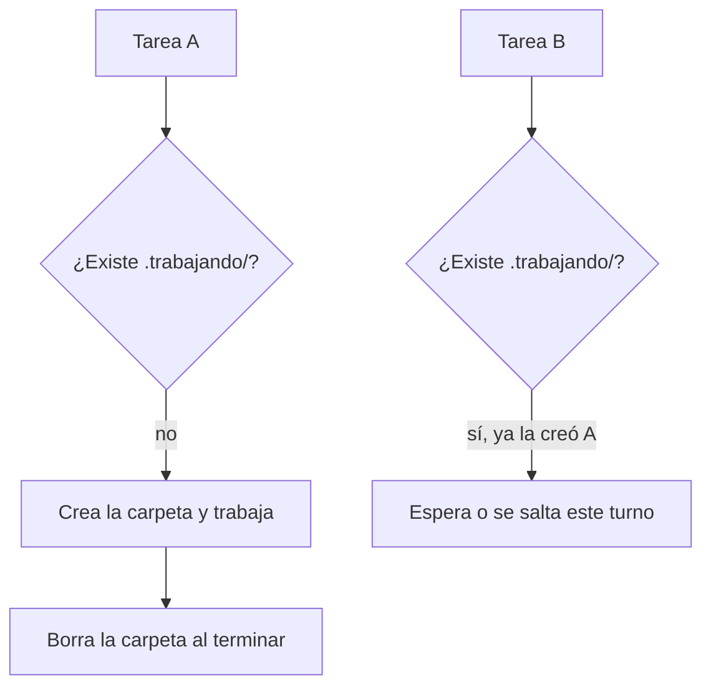

# Nivel 05 — Avanzado (opcional)

Este nivel es lectura, no tiene checkpoint obligatorio. Volvé acá cuando lo de antes ya te quede chico.

## Upgrade de memoria: de un archivo a un sistema real

El `memoria.md` del Nivel 01 funciona, pero no escala bien: se hace largo, no se puede buscar bien, y no se comparte fácil entre proyectos distintos. El upgrade natural es un sistema de memoria persistente dedicado (por ejemplo, un MCP de memoria) que guarda, busca y organiza por vos. El concepto de fondo no cambia — sigue siendo "el agente lee al empezar, escribe al cerrar" — solo lo hace mejor a escala.

## Upgrade de segundo cerebro: de carpetas a una app de notas

Herramientas como Obsidian toman la misma convención del Nivel 02 (carpeta + markdown + links) y le agregan un visor gráfico (grafo de conexiones, búsqueda, plugins). No cambia el modelo — tus notas siguen siendo archivos de texto simples — solo se ven mejor y son más fáciles de navegar.

## Si automatizás tareas: el problema de dos procesos tocando lo mismo a la vez

Cuando empezás a tener tareas automáticas/programadas (no solo conversaciones en vivo) que tocan los mismos archivos, puede pasar que dos corran casi al mismo tiempo y se pisen entre sí — una sobreescribe lo que la otra estaba por guardar.

La solución simple: un "candado" por carpeta. Antes de tocar los archivos compartidos, cada tarea intenta crear una carpeta con un nombre fijo (por ejemplo `.trabajando/`). Crear una carpeta es una operación que o funciona o falla — nunca "funciona a medias" — así que sirve de señal: si ya existe, significa que otra tarea la está usando, y hay que esperar o saltear ese turno. Al terminar, se borra la carpeta para liberar el paso.

No hace falta nada de esto hasta que tengas más de una tarea automática tocando los mismos archivos — antes de eso, es complejidad de más.
