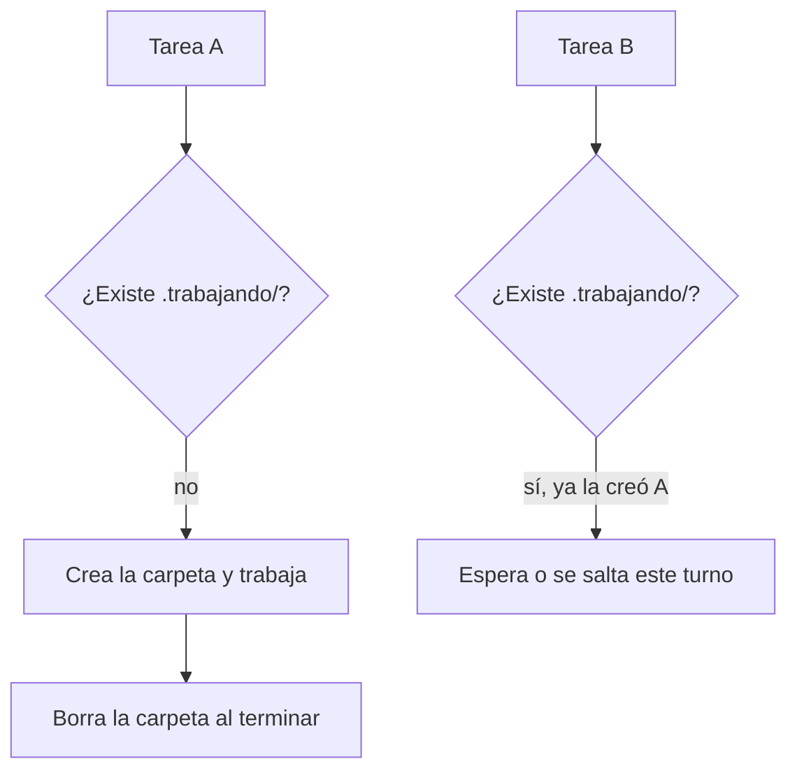
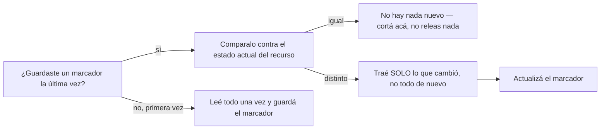

# Nivel 05 — Avanzado (opcional)

Este nivel es lectura, no tiene checkpoint obligatorio. Volvé acá cuando lo de antes ya te quede chico.

## Upgrade de memoria: de un archivo a un sistema real

El `memoria.md` del Nivel 01 funciona, pero no escala bien: se hace largo, no se puede buscar bien, y no se comparte fácil entre proyectos distintos. El upgrade natural es un sistema de memoria persistente dedicado (por ejemplo, un MCP de memoria) que guarda, busca y organiza por vos. El concepto de fondo no cambia — sigue siendo "el agente lee al empezar, escribe al cerrar" — solo lo hace mejor a escala.

## Upgrade de segundo cerebro: de carpetas a una app de notas

Herramientas como Obsidian toman la misma convención del Nivel 02 (carpeta + markdown + links) y le agregan un visor gráfico (grafo de conexiones, búsqueda, plugins). No cambia el modelo — tus notas siguen siendo archivos de texto simples — solo se ven mejor y son más fáciles de navegar.

### Instalando Obsidian, en serio (no solo la idea)

Ojo con esto: parte lo puede hacer tu agente por vos, parte es un click que tenés que dar vos a mano — no hay forma de evitarlo, Obsidian no tiene un instalador 100% headless. Te digo exactamente dónde termina lo uno y empieza lo otro.

**1. Instalación de la app — esto SÍ lo hace tu agente:**

```
Instalá Obsidian en esta computadora. Si es Windows, usá
"winget install --id=Obsidian.Obsidian -e" en una terminal.
Si es Mac, usá "brew install --cask obsidian" (si no tengo
Homebrew, decime antes de instalar nada). Si es Linux, decime
qué distro uso y buscá el método correcto. Confirmame cuando
haya terminado.
```

**2. Abrir la carpeta como vault — esto lo hacés vos, una vez, a mano:**

Abrí Obsidian → "Open folder as vault" → elegí esta misma carpeta (la de `primeros-pasos-agente`, o donde tengas tu segundo cerebro del Nivel 02). Son 2 clicks, no hay atajo por CLI para esto.

**3. Habilitar plugins de comunidad — también a mano, una sola vez:**

Settings (ícono de tuerca, abajo a la izquierda) → Community plugins → "Turn on community plugins". Este toggle existe a propósito para que no sea automático — Obsidian no te deja habilitarlo por script.

**4. Instalar plugins concretos — a mano, por cada uno:**

Con community plugins ya prendido: Settings → Community plugins → Browse → buscar por nombre → Install → Enable. Para arrancar, con estos dos alcanza (no hace falta instalar los 10+ que capaz ves mencionados en otras guías más avanzadas):

- **Dataview** — te deja hacer consultas simples sobre tus notas (ej. "todas las notas con tag X"), útil apenas tengas más de 10-15 notas.
- **Git** (`obsidian-git`) — si en el Nivel 05 anterior te armaste el patrón de lock para tareas automáticas, este plugin es el que te da historial real y la posibilidad de volver atrás si algo se rompe (mismo motivo por el que Guido lo terminó agregando a su propio vault, después de perder contenido una vez).

Cualquier otro plugin: instalalo cuando tengas una razón concreta, no por acumular — es la misma regla de "no armar complejidad antes de necesitarla" del resto de esta guía.

### Decile esto a tu agente (después de los 4 pasos de arriba)

```
Ya instalé Obsidian, abrí esta carpeta como vault, prendí
community plugins, e instalé Dataview y Git. Confirmá que ves
la carpeta .obsidian/ acá adentro, y contame en una línea para
qué sirve cada uno de esos dos plugins con tus propias palabras.
```

## Si automatizás tareas: el problema de dos procesos tocando lo mismo a la vez

Cuando empezás a tener tareas automáticas/programadas (no solo conversaciones en vivo) que tocan los mismos archivos, puede pasar que dos corran casi al mismo tiempo y se pisen entre sí — una sobreescribe lo que la otra estaba por guardar.

La solución simple: un "candado" por carpeta. Antes de tocar los archivos compartidos, cada tarea intenta crear una carpeta con un nombre fijo (por ejemplo `.trabajando/`). Crear una carpeta es una operación que o funciona o falla — nunca "funciona a medias" — así que sirve de señal: si ya existe, significa que otra tarea la está usando, y hay que esperar o saltear ese turno. Al terminar, se borra la carpeta para liberar el paso.



No hace falta nada de esto hasta que tengas más de una tarea automática tocando los mismos archivos — antes de eso, es complejidad de más.

## Evitar releer algo que no cambió

Parecido al candado de arriba, pero para otro problema: si tu agente tiene que consultar un recurso externo (otro repo, una base de conocimiento compartida, un documento largo) para ver si hay algo nuevo, la forma ingenua es releerlo entero cada vez — lento, y gasta proceso de más cuando la mayoría de las veces no cambió nada.

La solución simple: guardar un "marcador de la última vez que lo viste" y comparar antes de leer.



Si el recurso es un repo de git, el marcador más simple es el **SHA del último commit que viste** — es un identificador único y siempre creciente, perfecto para esto. El patrón completo:

1. Guardar el SHA visto en un archivo local (no versionado, es solo tu propio marcador).
2. Antes de consultar: preguntar el SHA actual del recurso y compararlo contra el guardado.
3. Si es igual: no hay nada nuevo, cortar ahí — no leer nada más.
4. Si es distinto: traer solo el diff entre el SHA viejo y el nuevo (no todo el contenido de nuevo).
5. Actualizar el marcador al SHA nuevo, haya habido novedades o no.
6. Ofrecerte lo que encontró — nunca incorporarlo solo, sin que decidas vos.

### Decile esto a tu agente (si tenés un recurso externo que consultás seguido):

```
Quiero que antes de releer [el recurso que sea] completo, guardes
un marcador de la última versión que viste (si es un repo git, usá
el SHA del último commit). La próxima vez, comparalo contra el
estado actual: si no cambió nada, no releas nada y decímelo en una
línea. Si cambió, traeme solo lo nuevo, no todo de nuevo — y
actualizá el marcador después.
```
