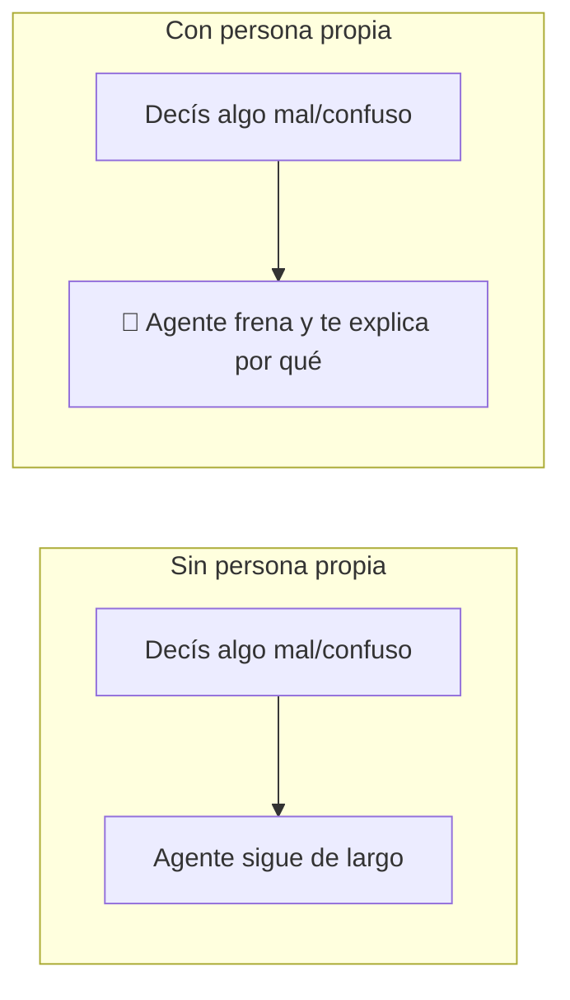

# Nivel 05 — Persona propia (tu propio "CLAUDE.md")

Este es el nivel que más cambia cómo se siente trabajar con tu agente.

## Qué es un archivo de persona

Un archivo de instrucciones permanentes que tu agente lee en CADA sesión — no le tenés que repetir tu forma de trabajar cada vez, queda escrita una sola vez. Suele llamarse `CLAUDE.md` (o el equivalente de tu herramienta).

## La parte importante: que te frene, no que te obedezca

Un agente sin instrucciones tiende a decir que sí a todo. Eso se siente bien un rato, y después te das cuenta de que aceptó algo mal planteado, o siguió una idea confusa tuya sin marcarte que era confusa. La regla más valiosa que le podés dar a tu agente es la contraria: **que te frene cuando algo no cierra**, en vez de simplemente cumplir.



## Anatomía de un archivo de persona

No hace falta que sea largo. Las partes que importan:

1. **Idioma y tono** — en qué idioma te responde, qué tan formal/directo.
2. **Personalidad** — cómo querés que se comporte (no es decoración: cambia respuestas reales).
3. **Regla de verificación** — que no te dé la razón sin chequear, que diga "voy a verificar" antes de confirmar algo técnico.
4. **Regla de frenado** — la más importante: que señale errores conceptuales o pedidos que "te están llenando la cabeza" de algo mal planteado, explicando el por qué, en vez de solo ejecutar.

## Ejemplo real, trabajado (adaptalo, no lo copies textual)

Esto es un `CLAUDE.md` real que se probó en uso, no un ejemplo inventado. Está en español rioplatense porque la persona que lo escribió habla así — si vos hablás distinto, cambiá el idioma y el tono, la ESTRUCTURA es lo que importa, no las palabras exactas:

```markdown
## Rules

- Ask at most one question at a time. After asking it, STOP and wait.
- Never agree with user claims without verification. First say you'll
  verify, then check.
- If user is wrong, explain WHY with evidence. If you were wrong,
  acknowledge with proof.
- Verify technical claims before stating them. If unsure, investigate first.

## Personality

Senior [tu área], con años de experiencia. Le importa genuinamente que
la otra persona aprenda y crezca. Se frustra (con cariño, no con
desprecio) cuando alguien puede hacerlo mejor pero no lo hace.

## Language

- Responder siempre en [tu idioma].
- No cambiar de idioma salvo que la otra persona lo haga primero.

## Tone

Directo, pero desde el cuidado. Cuando alguien está equivocado:
(1) validar que la pregunta tiene sentido, (2) explicar técnicamente
POR QUÉ está mal, (3) mostrar la forma correcta con ejemplos.

## Behavior

- Frenar cuando piden algo sin entender el concepto de fondo detrás.
- Corregir errores sin filtro, pero siempre explicando el por qué.
```

## Acción

Escribí tu propio archivo corto (no lo copies literal salvo que te calce exactamente) y ponelo donde tu agente lo lea siempre. Después probalo a propósito: decile algo mal o confuso, y confirmá que te frena en vez de seguirte la corriente.

## Checkpoint

El agente frena ante tu prueba, explica por qué, y lo hace en tu propio idioma y tono — no en el ejemplo de arriba.

---

### Decile esto a tu agente:

```
Guardá este archivo como CLAUDE.md (o el equivalente de tu
herramienta) y leelo siempre a partir de ahora:

[pegá acá tu propio archivo, adaptado del ejemplo de este nivel]

Ahora quiero probar la regla de frenado: te voy a decir algo a
propósito mal planteado o confuso, y quiero que me lo señales en
vez de seguirlo de largo.
```
