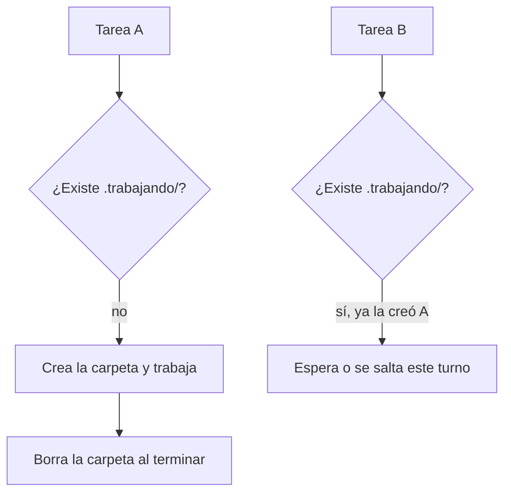
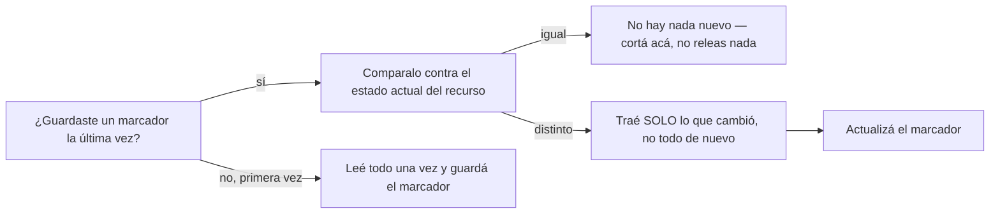
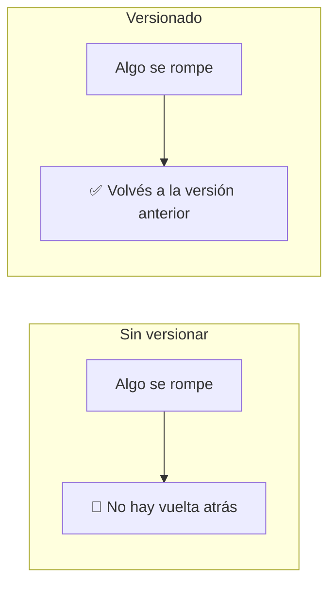
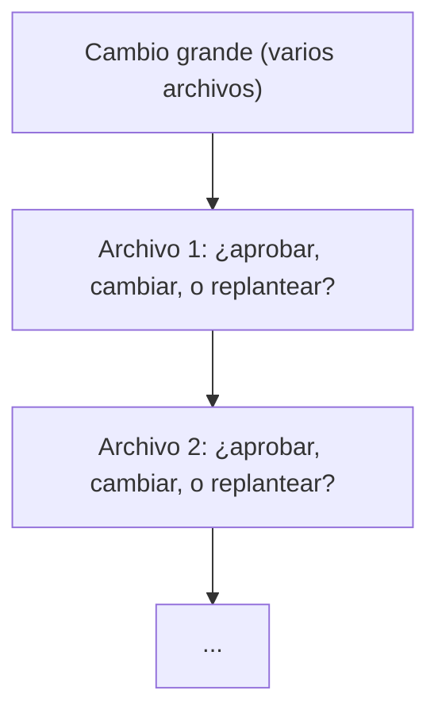

# 🧭 Nivel 06 — Avanzado (opcional)

Este nivel es lectura, no tiene checkpoint obligatorio. Volvé acá cuando lo de antes ya te quede chico.

## Upgrade de memoria: de un archivo a un sistema real

El `memoria.md` del Nivel 02 funciona, pero no escala bien: se hace largo, no se puede buscar bien, y no se comparte fácil entre proyectos distintos. El upgrade natural es un sistema de memoria persistente dedicado (por ejemplo, un MCP de memoria) que guarda, busca y organiza por vos. El concepto de fondo no cambia — sigue siendo "el agente lee al empezar, escribe al cerrar" — solo lo hace mejor a escala.

Un detalle a tener en cuenta si tenés más de un proyecto: estos sistemas suelen adivinar solos a qué proyecto pertenece cada cosa (por ejemplo, mirando en qué carpeta estás) — y a veces adivinan mal. Si notás que algo se guardó donde no correspondía, decile a tu agente el proyecto explícito cada vez, no confíes en que lo va a inferir bien siempre.

## Upgrade de segundo cerebro: ¿todavía no instalaste Obsidian?

Si en el Nivel 03 elegiste seguir con archivos de texto plano en vez de instalar Obsidian, ese es el momento de volver — la guía completa de instalación (con los clicks exactos que tenés que dar vos) está ahí, sección "Instalando Obsidian". Si ya la hiciste, no hay nada más que agregar acá.

## Si automatizás tareas: el problema de dos procesos tocando lo mismo a la vez

Cuando empezás a tener tareas automáticas/programadas (no solo conversaciones en vivo) que tocan los mismos archivos, puede pasar que dos corran casi al mismo tiempo y se pisen entre sí — una sobreescribe lo que la otra estaba por guardar.

La solución simple: un "candado" por carpeta. Antes de tocar los archivos compartidos, cada tarea intenta crear una carpeta con un nombre fijo (por ejemplo `.trabajando/`). Crear una carpeta es una operación que o funciona o falla — nunca "funciona a medias" — así que sirve de señal: si ya existe, significa que otra tarea la está usando, y hay que esperar o saltear ese turno. Al terminar, se borra la carpeta para liberar el paso.



No hace falta nada de esto hasta que tengas más de una tarea automática tocando los mismos archivos — antes de eso, es complejidad de más.

## Evitar releer algo que no cambió

Parecido al candado de arriba, pero para otro problema: si tu agente tiene que consultar un recurso externo (otro repo, una base de conocimiento compartida, un documento largo) para ver si hay algo nuevo, la forma ingenua es releerlo entero cada vez — lento, y gasta proceso de más cuando la mayoría de las veces no cambió nada.

La solución simple: guardar un "marcador de la última vez que lo viste" y comparar antes de leer.



Si el recurso es un repo de git, el marcador más simple es el **SHA del último commit que viste** — es un identificador único y siempre creciente, perfecto para esto. El patrón completo:

1. Guardar el SHA visto en un archivo local (no versionado, es solo tu propio marcador).
2. Antes de consultar: preguntar el SHA actual del recurso y compararlo contra el guardado.
3. Si es igual: no hay nada nuevo, cortar ahí — no leer nada más.
4. Si es distinto: traer solo el diff entre el SHA viejo y el nuevo (no todo el contenido de nuevo).
5. Actualizar el marcador al SHA nuevo, haya habido novedades o no.
6. Ofrecerte lo que encontró — nunca incorporarlo solo, sin que decidas vos.

> [!TIP]
> 🧭 **Decile esto a tu agente (si tenés un recurso externo que consultás seguido):**
>
> ```
> Quiero que antes de releer [el recurso que sea] completo, guardes
> un marcador de la última versión que viste (si es un repo git, usá
> el SHA del último commit). La próxima vez, comparalo contra el
> estado actual: si no cambió nada, no releas nada y decímelo en una
> línea. Si cambió, traeme solo lo nuevo, no todo de nuevo — y
> actualizá el marcador después.
> ```

## Versioná lo que tu agente edita

Hasta acá, cada error se corrige hablando. Pero hay un tipo de error distinto: un archivo se rompe o se pisa por accidente (un comando que salió mal, un cambio que no era lo que pediste), y sin nada que guarde el historial, no hay vuelta atrás — lo que había ahí antes se perdió de verdad.



La solución es barata y no hace falta entender git a fondo para usarla: un sistema de control de versiones guarda una copia de cada estado por el que pasó tu carpeta, para poder volver a cualquiera de ellas. El más usado se llama **git** — lo inicializás una sola vez, y de ahí en más le pedís a tu agente que guarde una "versión" (un commit) después de cambios importantes.

No hace falta que entiendas ramas ni nada más avanzado todavía para esto — alcanza con la versión mínima: inicializar, y guardar.

> [!TIP]
> 🧭 **Decile esto a tu agente:**
>
> ```
> Quiero empezar a versionar esta carpeta con git, para poder volver
> atrás si algo se rompe. Inicializalo acá (una sola vez), y hacé un
> primer guardado (commit) con todo lo que ya tengo. De ahí en más,
> después de cualquier cambio importante que hagamos juntos, quiero
> que me preguntes si guardamos una versión nueva.
> ```

## Revisar el trabajo de tu agente, de a un pedazo por vez

Cuando le pedís algo chico (un archivo, un cambio puntual), leer el resultado es fácil. El problema aparece cuando le pedís algo más grande — que toque varios archivos a la vez, o un cambio largo — y te llega todo junto: ahí es fácil terminar aprobando sin mirar de verdad, porque revisar todo junto cansa.



La solución: pedirle a tu agente que te muestre los cambios de a uno, y frente a cada uno tomás una de tres decisiones:

- **Lo apruebo tal cual.**
- **Quiero que lo cambie** — un detalle puntual de ESE archivo está mal, se corrige ahí mismo.
- **El enfoque entero está mal** — esto es distinto de lo anterior: no es que un detalle esté mal, es que la idea de fondo no sirve. Ahí no se parchea ese archivo — se vuelve a pensar el plan completo antes de seguir.

Confundir las dos últimas es el error más común: parchear un archivo cuando en realidad el problema era el enfoque deja el resto de los archivos construidos sobre una base que ya sabés que no sirve.

> [!TIP]
> 🧭 **Decile esto a tu agente:**
>
> ```
> A partir de ahora, cuando hagas un cambio que toque varios archivos,
> quiero que me los muestres de a uno, no todos juntos. Por cada uno,
> preguntame: lo apruebo tal cual, quiero que lo cambies (un detalle
> puntual), o el enfoque entero está mal (ahí paramos y repensamos el
> plan antes de seguir con el resto).
> ```
